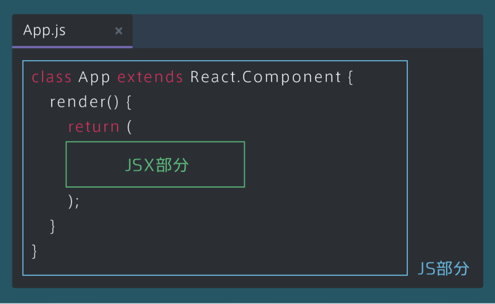
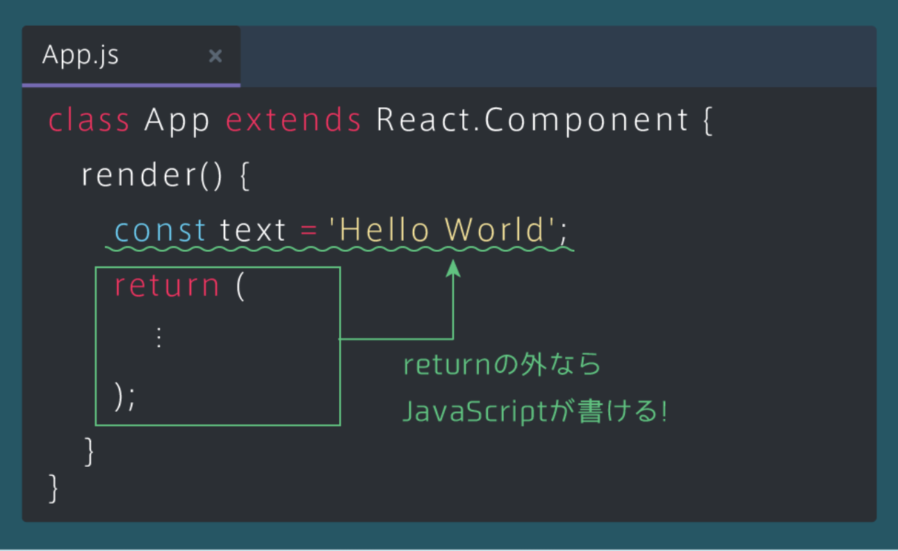
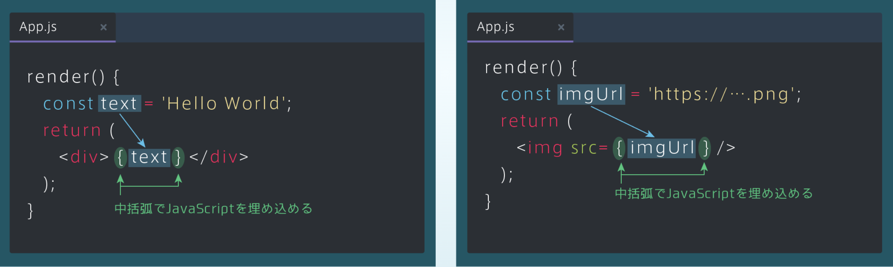
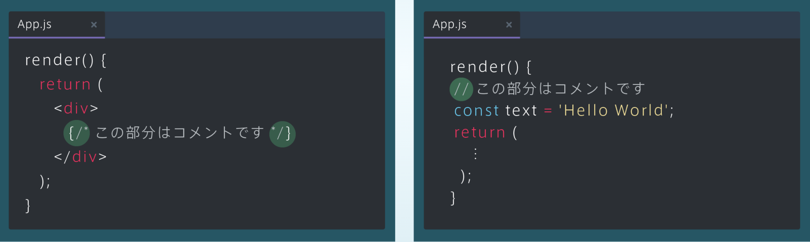

## JSXとJSについて
### JSXとJSの範囲
・下図の通り、JSXとJS ( JavaScript ) の記述部分は分かれている 
・renderメソッドのreturn内のみ、JSXで記述する必要がある 
・JSXで記述された要素はブラウザに表示される

### JavaScriptを記述する
・renderメソッドの、returnの外にはJavaScriptを記述できる 
・下図では、renderメソッドの中で、定数textをJavaScriptで定義しているが、returnの外なので記述することができる

### JSXにJSを埋め込む
・returnの中でも、JSXにJavaScriptを埋め込むことが出来る 
・JSXにJavaScriptを埋め込むには、JavaScriptの部分を中括弧{ }で囲む 
・また、右の図のようにタグの属性の値も、同様に中括弧{ }を使ってJavaScriptを記述することが出来る

### JSXとJSのコメント
・左の図のようにJSXを{/* */}で囲むと、その部分はコメントになる 
・また、JavaScriptのコメントは右の図のように文頭に「//」を書くと、その行はコメントとみなされる

