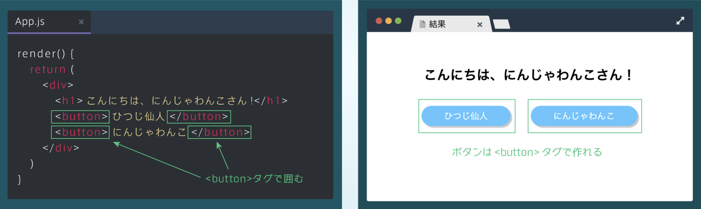
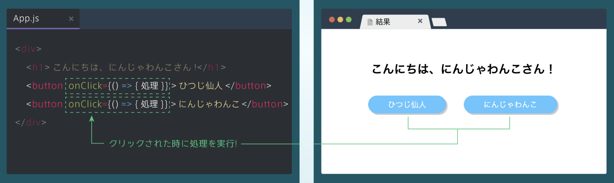
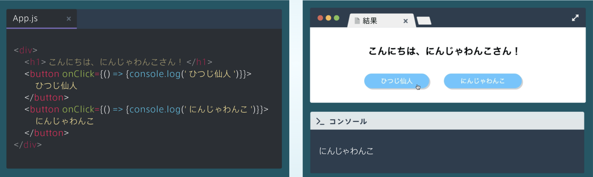
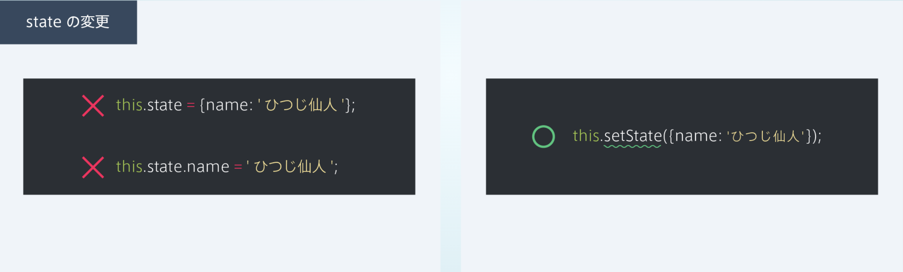

## 表示切り替えの準備

### ボタンを作ってみよう
・ボタンは< button>タグで指定<br>
・ボタンには< button>タグで囲まれている文字が表示される

```rb
render() {
    return (
       <div>
        <h1>こんにちは、にんじゃわんこさん！</h1>
        <button>ひつじ仙人</button>
        <button>にんじゃわんこ</button>
       </div>
    )
}
```


### ① イベント（何かが起きたときに、処理を実行するように指定）
・JSで学んだアロー関数を使って、タグ内に<br>
イベント名={() => { 処理 }}と書くことで、指定したタイミングで処理を実行できる<br>
・アロー関数はJavaScriptなので、{}で囲むことを忘れないように！
```rb
<button イベント名={() =>{ 処理 }}></button>
```

### onClickイベント
・イベント名にonClickを指定し、<button onClick={() => {処理}}>とする<br>
・アロー関数の処理部分には、イベント時に実行する処理を書く

```rb
[App.js]
<div>
    <h1>こんにちは、にんじゃわんこさん！</h1>
    <button onClick={() => { 処理 }} > ひつじ仙人 </button>
    <button onClick={() => { 処理 }} > にんじゃわんこ </button>
</div>
```



### onClickでコンソール出力
・クリックしたときに指定した処理が呼び出されることを確認するために、アロー関数の処理でconsole.logを行ってみる

```rb
<div>
    <h1>こんにちは、にんじゃわんこさん！</h1>
    <button onClick={() => {console.log('ひつじ仙人')}} > ひつじ仙人 </button>
    <button onClick={() => {console.log('にんじゃわんこ ')}} > にんじゃわんこ </button>
    
</div>
```


### ② state（ステイト：ユーザーの動きに合わせて変わる値のこと）
・今回はボタンを押すと、それに合わせて「こんにちは、◯◯さん！」の◯◯という名前の部分が変わるようにする

### STEP1. stateの定義
・stateは、constructorの中で、オブジェクトとして定義する<br>
・ここで定義したオブジェクトがstateの初期値となる<br>
・その他の部分の、「constructor(props)」や「super(props);」といった処理はいつも同じ記述をするため、定型文として覚えておけばOK

```rb
[App.js]
class App extends React.Component {
    constructor(props) {
       super(props);
        this.state = { name: 'にんじゃわんこ' };
     }
} 
```

### STEP2. stateの表示
### stateの取得
・定義したstateは、this.stateで取得することができる<br>
・stateの定義で学んだ通り、stateはオブジェクトなので、console.log(this.state)をするとオブジェクトが出力される<br>

```rb
[App.js]
class App extends React.Component {
    constructor(props) {
       super(props);
        this.state = { name: 'にんじゃわんこ' };
     }
     render(){
        console.log(this.state);
        return(
           ⋮
        );
     }
} 
```

 ### stateを表示する
 ・this.stateはオブジェクトなので、this.state.プロパティ名とすることで、指定したstateのプロパティ名に対応する値を取得できる<br>
・下図では、this.state.nameで「にんじゃわんこ」を取得して、ブラウザに「こんにちは、にんじゃわんこさん！」と表示している

```rb
[App.js]
class App extends React.Component {
    constructor(props) {
       super(props);
        this.state = { name: 'にんじゃわんこ' };
     }
     render(){
        console.log(this.state);
        return(
            <h1>こんにちは、{ this.state.name }さん! <h1>
        );
     }
} 
```


### STEP3. stateの変更
・this.setState({プロパティ名: 変更する値})とすることで、指定されたプロパティに対応するstateの値が変更される<br>
・その結果、「this.state.name」で表示できる値も変更される<br>
・今回はボタンがクリックされた時に、名前の表示を変えるために、右の図のようにsetStateをonClick内で行う

```rb
[App.js]
 this.setState({ name : 'にんじゃわんこ' });
```


<details><summary>state変更の注意点</summary>
stateの変更には、注意点がある<br>
・Reactでは、下図のように「stateの値に直接代入することで値を変更してはいけない」という決まりがある<br>
・値を変更したい場合は、setStateを使う<br>


</details>