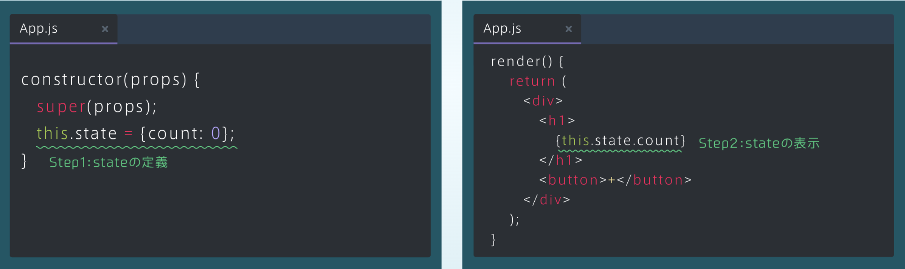

## カウントアップ機能を作ろう（1）
### stateの定義と表示
・stateの３つのStepを使って、カウントアップ機能を実装しよう<br>
・まずは、「Step1: stateの定義」と「Step2: stateの表示」を実装していく

```rb
[App.js]
import React from 'react';

class App extends React.Component {
  constructor(props) {
    super(props);
    this.state = {count : 0};
  }
  
  render() {
    return (
      <div>
        <h1>
          {this.state.count}
        </h1>
        <button>+</button>
      </div>
    );
  }
}

export default App;

```


## カウントアップ機能を作ろう（2）
### メソッドの定義
・次にstateの３つのStepの「Step3: stateの変更」を実装していく<br>
・Step3では、stateのcountの値に1を足すメソッドを定義して、+ボタンをクリックしたときに、そのメソッドを呼び出すようにする<br>
・stateのcountの値に1を足すことで、表示されるカウントも1足されたものが表示される

```rb
[App.js]
handleClick() {
     this.setState({count: thhis.state.count + 1});
}
```

### メソッドの呼び出し
・最後に、+ボタンをクリックしたときに、handleClickメソッドを呼び出すようにする

```rb
[App.js]
import React from 'react';

class App extends React.Component {
  constructor(props) {
    super(props);
    this.state = {count: 0};
  }
  
  // handleClickメソッドを定義してください
  handleClick() {
      this.setState({count: this.state.count + 1});
  }
  
  render() {
    return (
      <div>
        <h1>
          {this.state.count}
        </h1>
        {/* <button>タグ内でonClickイベントを追加してください */}
        <button onClick={() => {this.handleClick()}}>+</button>
        
      </div>
    );
  }
}

export default App;
```