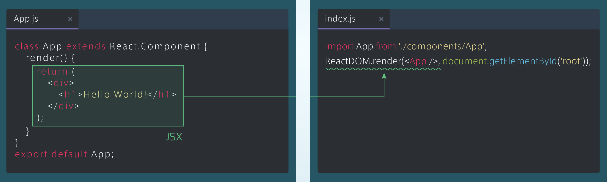
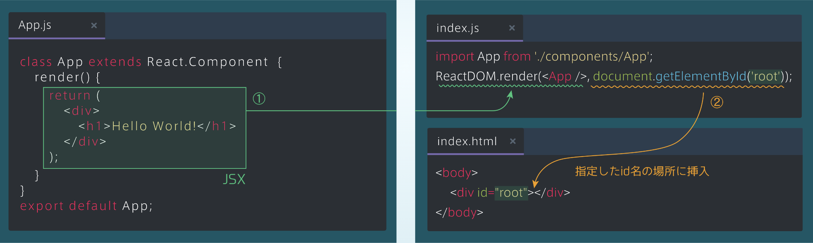
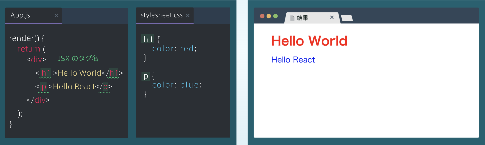
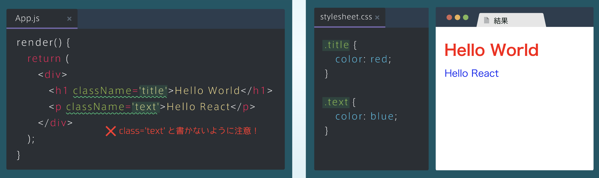

## Reactの表示の仕組み
### ブラウザに表示される流れ
・App.jsに書かれているJSXは最終的にHTMLに変換されて、ブラウザに表示される<br>
・Reactのコードを実際にブラウザに表示するには、App.js以外にもindex.jsとindex.htmlというファイルが必要

### App.jsとindex.jsの関係
・index.js内で「ReactDOM.render(< App />, ...」と書くことで、App.jsのJSXが、HTMLに変換される<br>
・この書き方は定型文のようなものなので、暗記しておく必要はない

```rb
[index.js]
import App from './components/App';
ReactDOM.render(<App/>,document.getElementByld('root'));
```



### index.jsとindex.htmlの関係
・さらに「..., document.getElementById('id名'));」と書くことで、変換されたHTMLがindex.htmlの指定したid名の要素の中に挿入される<br>
・今回は、id名rootを指定
・最終的に、index.htmlの内容がブラウザに表示される

```rb
[index.js]
import App from './components/App';
ReactDOM.render(<App/>,document.getElementByld('root'));
```
```rb
[index.html]
<body>
<div id="root"></div>
</body>
```


## CSSをつけよう
### CSSを読み込む
・JSXは最終的にindex.htmlに挿入され、ブラウザに表示されるため、index.html内でstylesheet.cssを読み込むことで、CSSを適用することができる

```rb
[index.html]
<head>
    <link rel="stylesheet" href="stylesheet.css">
</head>
<body>
    <div id="root">
       ~ここにHTMLが挿入される~
    </div> 
</body>
```

### CSSを適用する
・JSXにはHTMLと同じように、JSXのタグ名を指定してCSSを適用することができる<br>



### JSXとクラス名
・JSXにクラス名をつける場合、HTMLと書き方が違うため注意<br>
・クラス名は、左の図のように「className='クラス名'」とする<br>
・CSSの指定方法は変わらない


