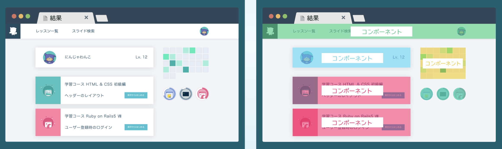
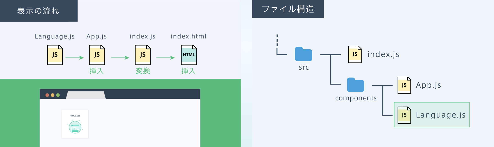
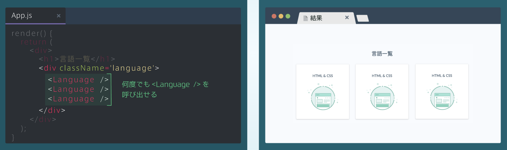

## コンポーネントの作成
### コンポーネントを学ぼう
・コンポーネントは「部品」や「パーツ」という意味<br>
・Reactでは、見た目を機能ごとにコンポーネント化して、コンポーネントを組み合わせることでWebサイトの見た目を作る



### コンポーネントの構成（1）
① Reactをインポート<br>
② React.Componentを継承するLanguageクラスを作成<br>
👉このクラスがコンポーネントとなる

```rb
[Language.js]
import React from 'reacr';
class Language extends React.Component {
       ↪︎クラス名がコンポーネントの名前になる
    render() {
        ⋮
    }
}
```
### コンポーネントの構成（2）
・作成したクラスの中で、renderメソッドを定義し、return内にJSXを記述<br>
・最終的に、下図の構成でLanguageコンポーネントを作成することができる

```rb
[Language.js]
import React from 'reacr';
class Language extends React.Component {
    render() {
       return(
        ~ JSX ~
       );
    }
}
```

### Languageコンポーネントが表示される流れ
・左の図の流れで、Languageコンポーネントはブラウザに表示される<br>
・LanguageコンポーネントをApp.jsで呼び出して、表示させることで、最終的にLanguageコンポーネントがブラウザに表示される



### コンポーネントの表示（1）
・App.js内でLanguageコンポーネントを呼び出すには、まず下図のように作成したコンポーネントをexportする必要がある

```rb
[Language.js]
import React from 'reacr';
class Language extends React.Component {
    render() {
       return(
        ~ JSX ~
       );
    }
}
export default Language;
```
### コンポーネントの表示（2）
・Languageコンポーネントを表示するには、App.jsで下図の2つの手順を行う必要がある

```rb
[App.js]
import React from 'reacr';
import Language from './Language';　①コンポーネントをインポート
class Language extends React.Component {
    render() {
       return(
         <div>
           <h1>言語一覧</h1>
           <Language />　②JSX内に<コンポーンネント名 />と書く
        </div>
           ⋮
```

## コンポーネントの使い方
### コンポーネントの特徴
・コンポーネントは一度作れば、左の図のように、何度でも呼び出すことができる

```rb
[App.js]
    render() {
       return(
        <div>
           <h1>言語一覧</h1>
           <div className='language'>
             <Language />
             <Language />
             <Language />
           </div>
        </div>
       );
    }
```



