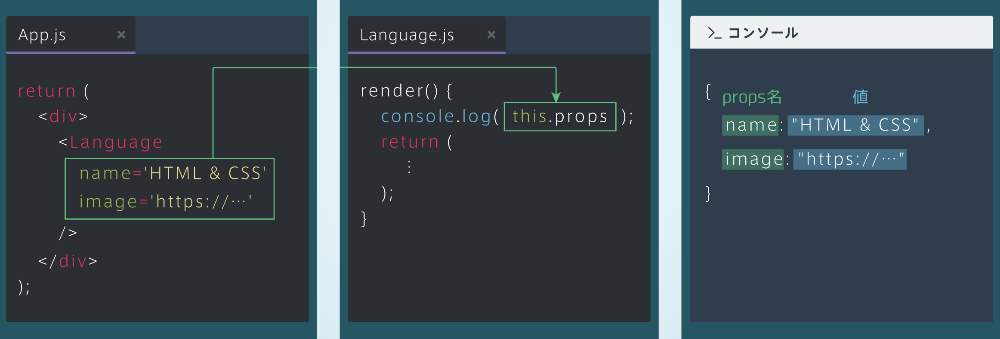
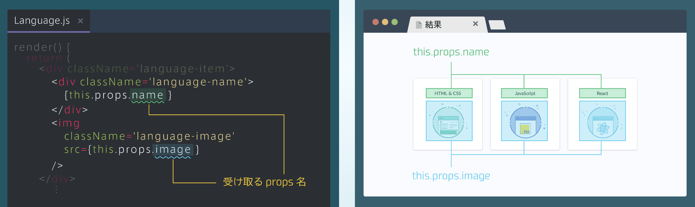

## props
### propsとは
・App.jsから、各言語の名前と画像のデータをLanguageコンポーネントに渡すことによって、言語ごとに表示を変えることができる<br>
・App.jsから渡すこのデータをprops（プロップス）という

### propsの渡し方
・propsは、「props名=値」という形で、コンポーネントを呼び出す箇所で渡す<br>
・今回は、Languageコンポーネントにnameとimageという2つのpropsを渡している<br>
・タグの中身は、改行してあげることで見やすくなる<br>

```rb
[App.js]
    render() {
       return(
        <div>
           <Language
              name = 'HTML & CSS'
              image = 'http://･･･'
            />
            ⋮
        </div>
```
### propsの中身
・渡されたpropsは、this.propsで取得できる<br>
・this.propsは{ props名: 値}というオブジェクトになる



### propsの取得
・this.propsと書くことで{props名: 値}というオブジェクトを取得できるので、「this.props.props名」とすることでpropsの値を取得できる<br>
・下図では、取得したpropsを用いて、各言語の名前と画像を表示している

```rb
[language.js]
render() {
  return (
    <div className='language-item'>
      <div className='language-name'>
        {this.props.name}
      <div>
      
        src={this.props.image}
      />
    </div>
```
