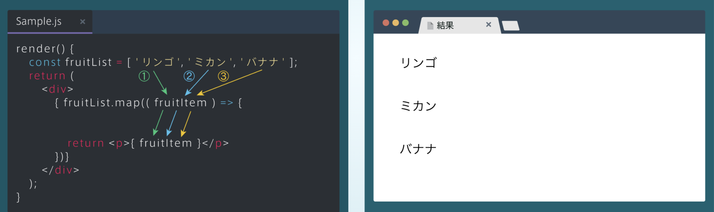

## mapメソッド
### map
・下図は、JSXをmapを用いて効率的に表示している例<br>
・mapメソッドで配列fruitListの各要素に対して順に処理を行い、各要素を< p>タグで囲んで表示している<br>
・mapメソッドの戻り値はJSXなので、引数であるfruitItemは中括弧{}で囲むことに注意



### mapを使ってみよう
・言語ごとの情報を持つlanguageList配列に対して、下の図のようにmapメソッドを用いると、簡単に各言語のLanguageコンポーネントを表示できる

```rb
[App.js]
const languageList = [
    {name: 'HTML&CSS' , image: 'https://･･･' }
];
    ⋮
return (
   <div>
       {languageList.map(( lamguageItem ) => {
           return (
              <Language
                     name={languageItem.name}
                     image={languageItem.image}
               />
　　 ⋮
```

