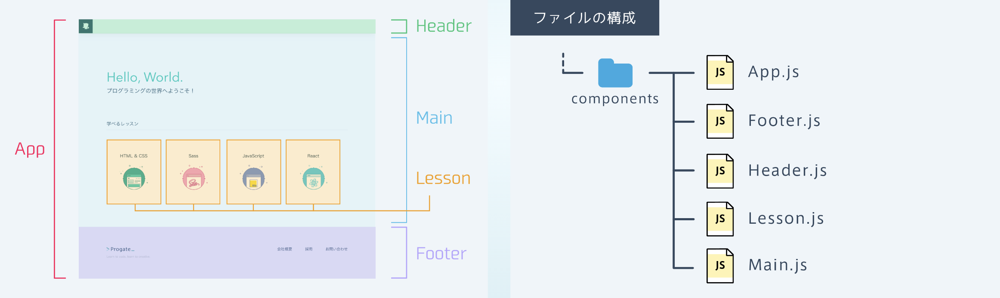
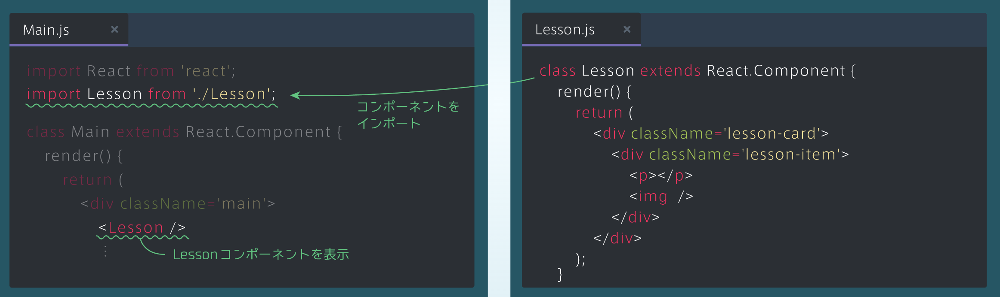
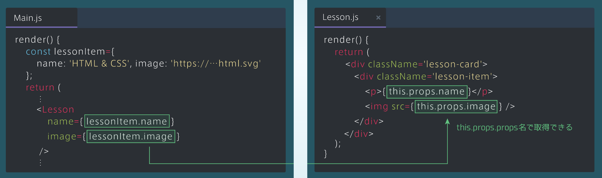
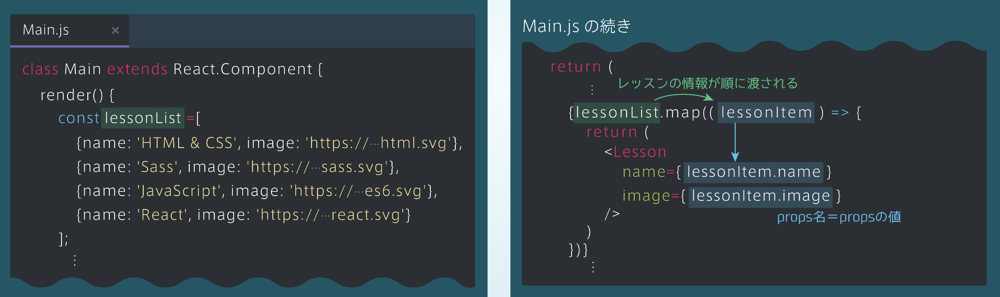

## Reactで Webサイトを作ろう
・レッスンのカードをクリックすると、ポップアップが表示される（ポップアップのことをモーダルと呼ぶ）

### コンポーネントのファイル
・サイトは左の図のように、複数のコンポーネントからできている<br>
・Appコンポーネントの中に、Header, Main, Footerという3つのコンポーネントがあり、さらにMainコンポーネントの中に4つのLessonコンポーネントがある



### ◽️ Lessonコンポーネントを表示しよう（1つ）
・表示させるために、まずはMain.jsでLessonコンポーネントをimportする<br>
・Lessonコンポーネントは、< Lesson /> で表示

```rb
[Main.js]
import React from 'reacr';
import Lesson from './Lesson';　①コンポーネントをインポート
class Lesson extends React.Component {
    render() {
       return(
         <div>
           <h1>言語一覧</h1>
           <Lesson />　②Lessonコンポーンネントを表示
        </div>
           ⋮
```

```rb
[Lesson.js]
class Lesson extends React.Component {
    render() {
       return(
         <div className='lesson-card'>
            <div className='lesson-item'>
               <p></p>
               
            </div>
        </div>
       );
    }
```



### propsを渡す
・< Lesson /> の部分で、props名=propsの値 とするとpropsを渡せる<br>
・下図のように、定数lessonItemにレッスン情報のオブジェクトが代入されている<br>
→これを用いてpropsを渡す

```rb
[Main.js]
    render() {
       const lessonItem={
         name: 'HTML&CSS',image: 'https://･･･html.svg'
       };
       return(
          ⋮
        <lesson
           name={lessonItem.name}
           image={lessonItem.image}
        />
          ⋮
```

### propsを受け取る
・Lessonコンポーネントに渡されたpropsは「this.props.props名」で取得できる

```rb
[Main.js]
    render() {
       const lessonItem={
         name: 'HTML&CSS',image: 'https://･･･html.svg'
       };
       return(
          ⋮
        <lesson
           name={lessonItem.name}
           image={lessonItem.image}
        />
          ⋮
```
```rb
[Lesson.js]
    render() {
       return(
         <div className='lesson-card'>
            <div className='lesson-item'>
               <p><{this.props.name}/p>
               
            </div>
        </div>
       );
    }
```



### ◽️ Lessonコンポーネントを表示しよう（複数）
### 配列とmap
・配列lessonListに対してmapメソッドを使い、Lessonコンポーネントを表示する<br>
・右の図のlessonItemという引数には、配列lessonListの要素である各レッスンのオブジェクトが順に代入される<br>
・lessonItemを用いて、nameとimageのpropsを渡す


```rb
[Main.js]
class Lesson extends React.Component {
    render() {
       const lessonList = [
           {name: 'HTML&CSS',image: 'http://･･･html.svg'},
           {name: 'Sass',image: 'http://･･･sass.svg'},
           {name: 'JavaScript.',image: 'http://･･･es6.svg
'},
           {name: 'React.',image: 'http://･･･react.svg'},
    return(
       ⋮
   {lessonList.map(( lessonItem ) => {
	 return(
	   <lesson
        name={ lessonItem.name }
        image={ lessonItem.image }
        />
    )
})}
  　⋮
```
