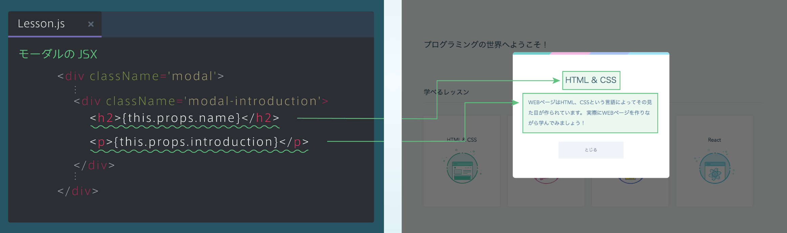
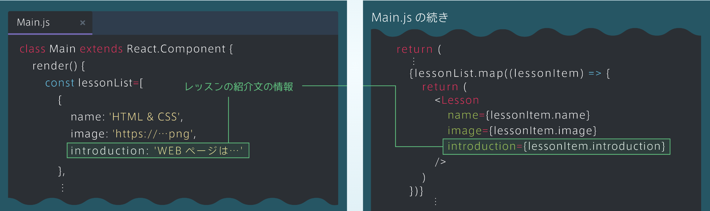
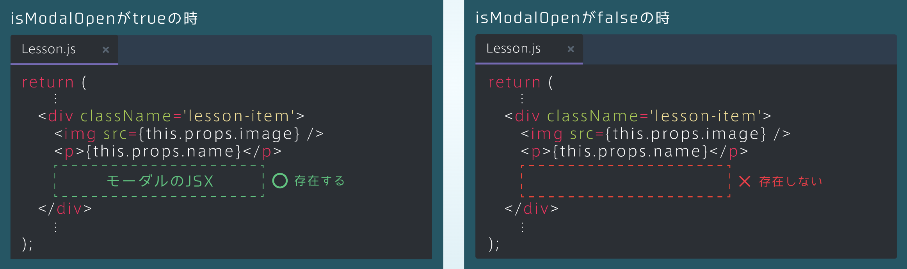
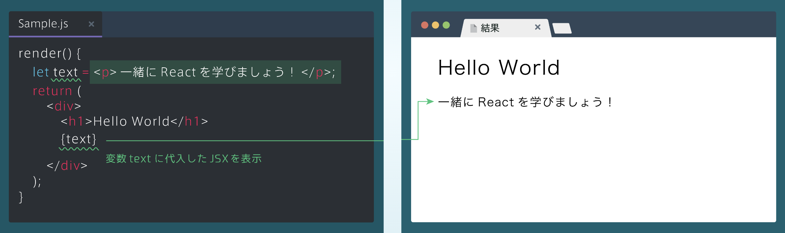
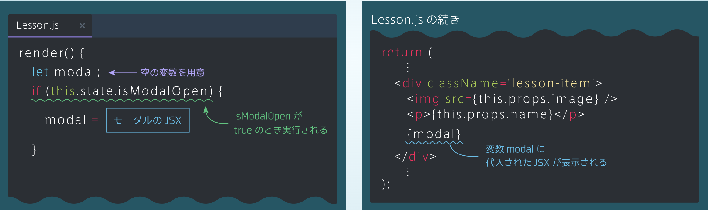
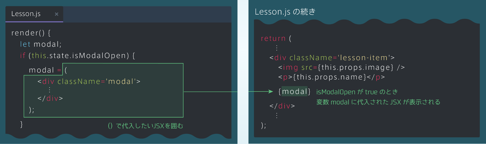
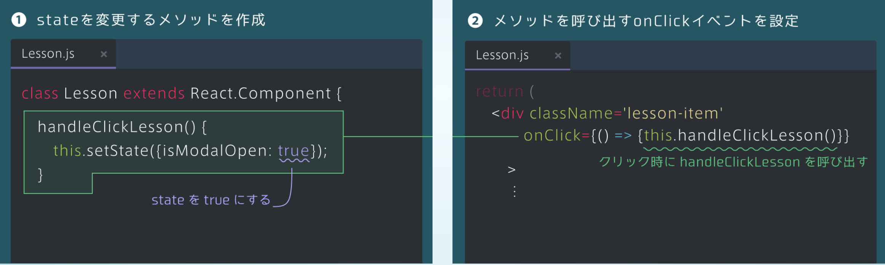
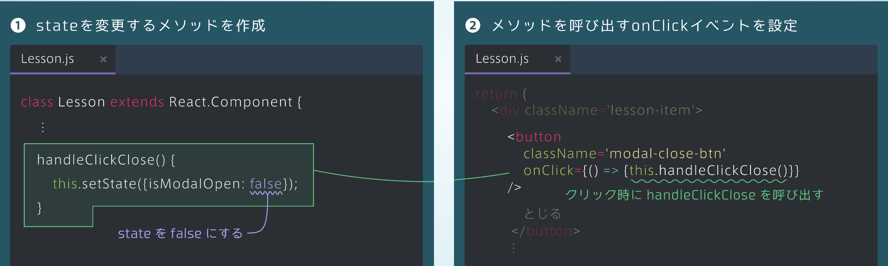

## モーダルのJSX
### モーダルの作成
・Lessonコンポーネントの中にモーダルのJSXを追加する<br>
・モーダルには「レッスンの名前」と「レッスンの紹介文」を表示する



### レッスン情報の修正
・モーダルで表示する「レッスンの紹介文」の情報を配列に追加する<br>
・配列lessonListのそれぞれの要素に、introductionというプロパティを追加し、Lessonコンポーネントにpropsとして渡す

```rb
[Main.js]
class Main extends React.Component {
    render() {
        const lessonList=[
            {
                name: 'HTML&CSS',
                image: 'https://･･･png',
                introduction: 'WEBページは･･･'
            },
    return(
       ⋮
       {lessonList.map((lessonItem) => {
         return(
            <Lesson
               name={lessonItem.name}>
               image={lessonItem.image}>
               introduction={lessonItem.introduction}
            />
         )
       })}
        ⋮
```


## モーダルを隠そう（1）
### モーダルの表示・非表示
・モーダルは、クリックによって表示/非表示が切り替わる。そこでモーダルが表示されているかそうでないかという情報をstateにする<br>
・isModalOpenという真偽値型のstateを用意し、trueなら表示、falseなら非表示になるようにする

### stateの定義
・stateは、constructorで定義<br>
・今回、初期状態でモーダルは非表示にしたいので、「isModalOpen」の初期値をfalseにする<br>

```rb
class Lesson extends React.Component {
    constructor(props) {
        super(props);
        this.state={isModalOpen: false}
    };
    ⋮
```
## モーダルを隠そう（2）
### 非表示の考え方
・下図のように「isModalOpen」がtrueのときはモーダルのJSXが存在し、falseのときは存在しないようにすれば、表示<br>
・非表示を切り替えることができる



### JSXと変数
・「モーダルのJSX」には変数を利用していく<br>
・JSXは、下図のように、変数に代入し{変数名}で表示することができる



### JSXとif文（1）
・isModalOpenがtrueのときだけモーダルが表示されるようにする<br>
・左の図のように変数modalを用意し、条件分岐を行えば、isModalOpenがtrueのときだけJSXが代入される



### JSXとif文（2）
・変数に代入するJSXが複数行の場合、下図のようにJSXを()で囲む



<details><summary>コード</summary>

```rb
import React from 'react';

class Lesson extends React.Component {
  constructor(props) {
    super(props);
    this.state = {isModalOpen: false};
  }

  render() {
    // 変数modalを定義してください
    let modal;
    
    // if文を用意してください
    if(this.state.isModalOpen){
      modal=(
      <div className='modal'>
          <div className='modal-inner'>
            <div className='modal-header'></div>
            <div className='modal-introduction'>
              <h2>{this.props.name}</h2>
              <p>{this.props.introduction}</p>
            </div>
            <button className='modal-close-btn'>
              とじる
            </button>
          </div>
        </div>
        );
    }
    
    return (
      <div className='lesson-card'>
        <div className='lesson-item'>
          <p>{this.props.name}</p>
          
        </div>
        {/* 変数モーダルを表示してください */}
        { modal}
      </div>
    );
  }
}

export default Lesson;
```
</details>

## モーダルの表示・非表示
### モーダルの表示
・下図の手順で、レッスンのカードをクリックしたときに、モーダルを表示できるようにようにする

①stateを変更するメソッドを作成
```rb
[Lesson.js]
class Lesson extends React.Component {
    handleClickLesson() {
        this.setState({isModalOpen: true});
    }
}
```
②メソッドを呼び出すonClickイベントを設定
```rb
[Lesson.js]
return(
    <div className='lesson-item'
    onClick={()=>{this.handleClickLesson()}}
    >
    ⋮
```


### モーダルの非表示（とじるメソッド）
・下図の手順で、「とじる」ボタンをクリックしたときに、モーダルが閉じるようにする

①stateを変更するメソッドを作成
```rb
[Lesson.js]
class Lesson extends React.Component {
    ⋮
    handleClickClose() {
        this.setState({isModalOpen: false});
    }
```
②メソッドを呼び出すonClickイベントを設定
```rb
[Lesson.js]
return(
  <div className='lesson-item'>
    <button
      className='modal-close-btn'
      onClick={()=>{this.handleClickClose()}}
    >
    とじる
    </button>
    ⋮
```

