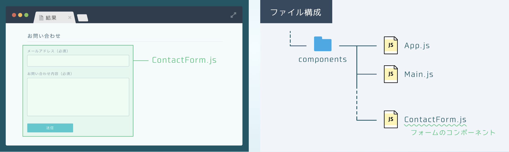
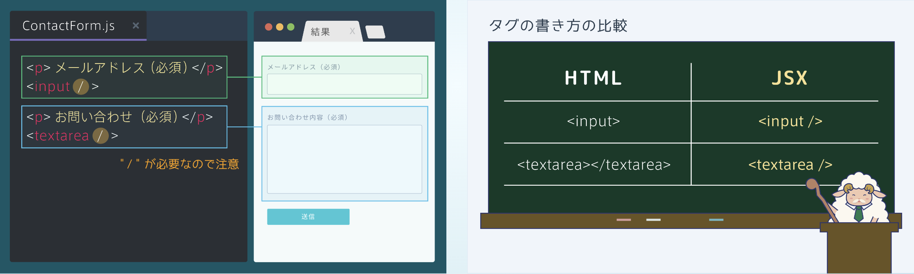
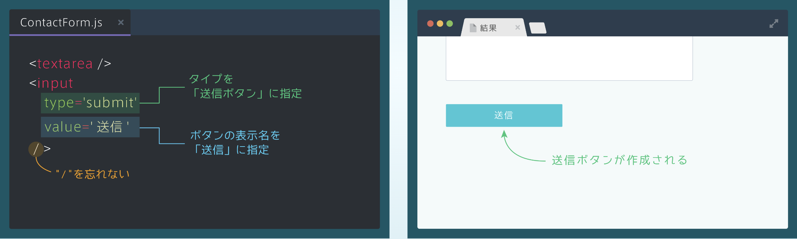
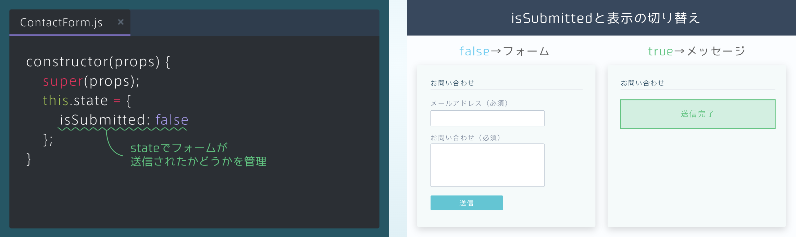
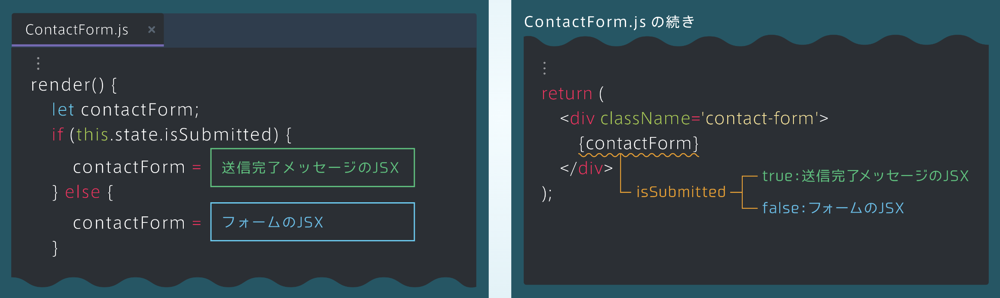
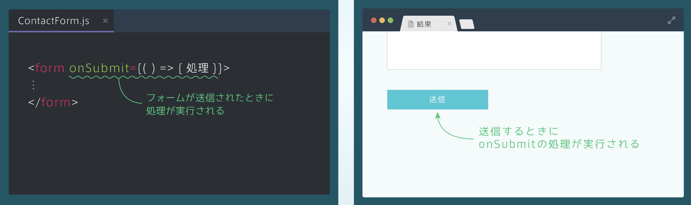
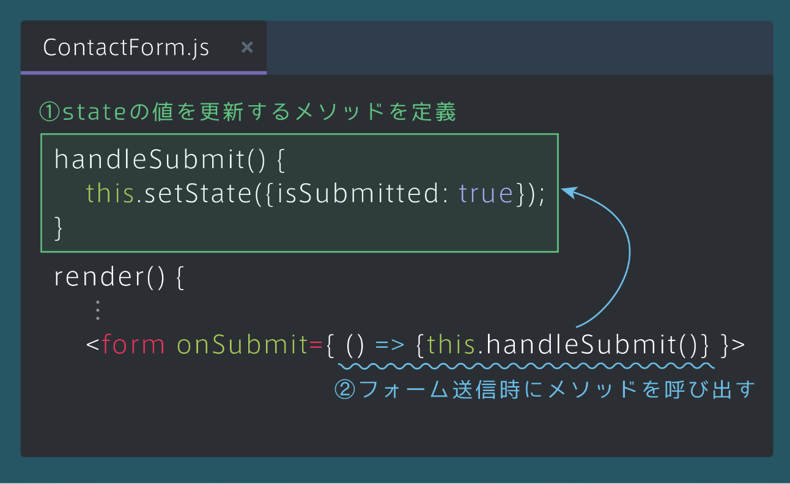

## お問合せフォームの作成（inputとtextarea）
### コンポーネントの構成
・lesson3で作ったサイトは複数のコンポーネントからできている<br>
・そこに新たにContactFormというコンポーネントを作成し、お問い合わせフォームを作っていく



### 入力欄のJSX
・今回はメールアドレスの入力欄（inputタグ）と、お問い合わせ内容の入力欄（textareaタグ）を作成<br>
・フォームのJSXは、HTMLと違った書き方をするので気をつける

```rb
[ContactForm.js]
<p>メールアドレス（必須）</p>
<input />

<p>お問い合せ（必須）</p>
<textarea />
```



### 送信ボタンのJSX
・送信ボタンはinputタグを用い、type='submit'<br>
・また、ボタンの表示名を変更するために、value='表示名'を指定<br>
・こちらも/(自己クローズタグ)を忘れないように気をつける

```rb
[ContactForm.js]
<textarea />
<input
  type='submit'
  value='送信'
/ >
```


### formタグ
・フォーム全体は、<form>タグで囲む必要がある<br>
・入力欄と送信ボタンを囲むように、<form>タグを書く

```rb
[ContactForm.js]
<form>
     ⋮
    <textarea />
    <input
       type='submit'
       value='送信'
    / >
</form>
```
## 送信完了メッセージの作成
### 表示切り替えの仕組み
・フォームが送信されたかどうかをstateで管理する<br>
・isSubmittedという真偽値型のstateを用意する。最初フォームは送信されていないため、isSubmittedの初期値はfalse<br>
・そして右の図のように、isSubmittedの値によって表示を切り替える

```rb
[ContactForm.js]
constructor(props) {
   super(props);
   this.state = {
       isSubmitted: false
   };
}
```


### stateと条件分岐
・lesson3で学んだように、条件分岐で表示するJSXを変更する

```rb
[ContactForm.js]
⋮
render(){
    let contactForm;
    if(this.state.isSubmitted){
       contactForm = 送信完了メッセージのJSX
    }else{
       contactForm = フォームのJSX 
    }
⋮
return(
    <div className='contact-form'>
      {contactForm}
    </div>
);
```


<details><summary>コード</summary>

```rb
import React from 'react';

class ContactForm extends React.Component {
  constructor(props) {
    super(props);
    this.state = {
      /* isSubmittedというstateを定義してください */
      isSubmitted: false
    };
  }

  render() {
    /* 空の変数contactFormを定義してください */
    let contactForm;
    
    /* isSubmittedを条件式とするif文を作成してください */
    if (this.state.isSubmitted) {
      contactForm = (
        <div className='contact-submit-message'>
          送信完了
        </div>
      );
    } else {
      contactForm = (
        <form>
          <p>メールアドレス（必須）</p>
          <input />
          <p>お問い合わせ内容（必須）</p>
          <textarea />
          <input
            type='submit'
            value='送信'
          />
        </form>
      );
    }
    
    return (
      <div className='contact-form'>
        {contactForm}
      </div>
    );
  }
}

export default ContactForm;
```
</details>

## onSubmitとstateの更新
### onSubmitイベント
・フォームが送信されたときに処理を実行するには、formタグに対してonSubmitイベントを指定する

```rb
[ContactForm.js]
<form on Submit={() => {処理 }}>
⋮
</form>
```


### stateを更新するメソッド
・下図のようにstateの値を変更するメソッドを作成し、フォームの送信時に呼び出す

```rb
[ContactForm.js]
handleSubmit(){
   this.setState({isSubmitted: true});
}
render(){
     ⋮
  <form onSubmit={() =>{this.handleSubmit()} }>
```

