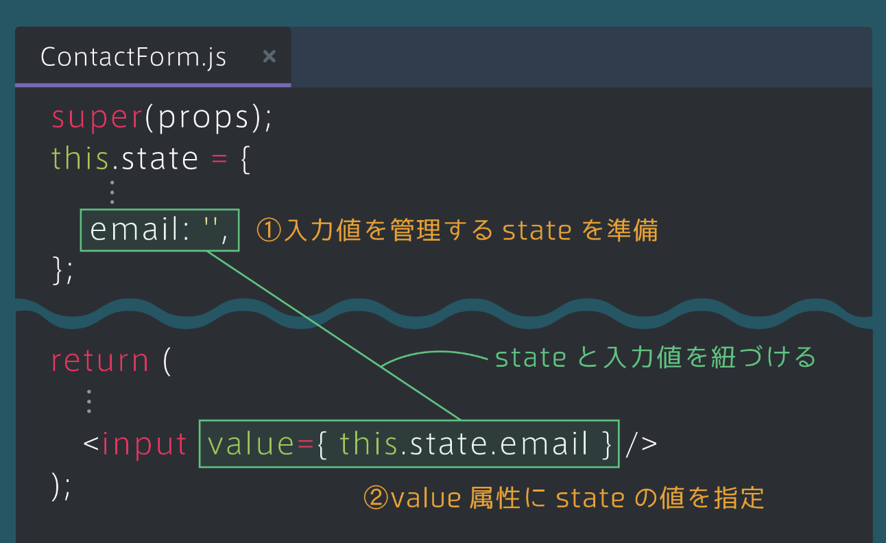
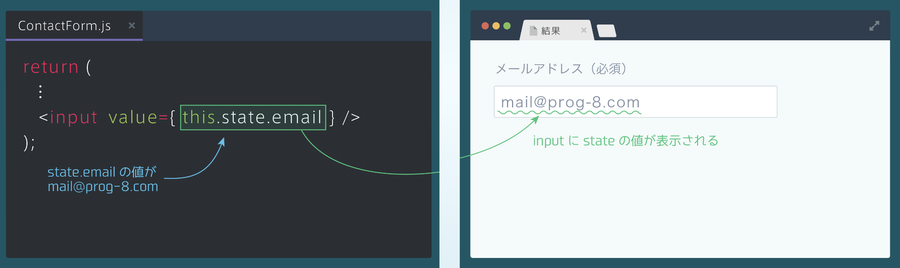
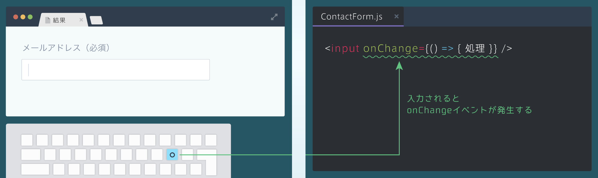
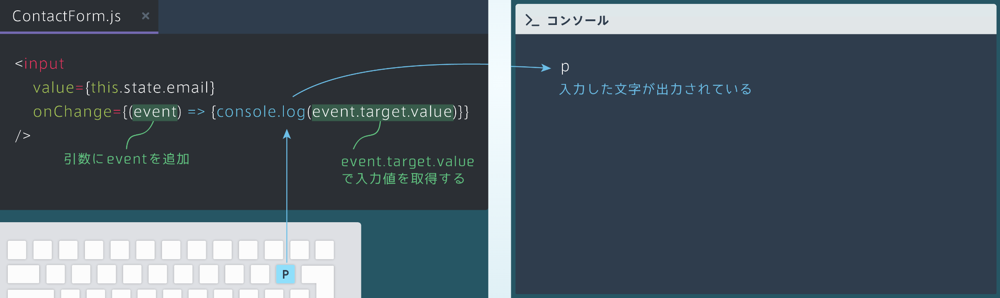
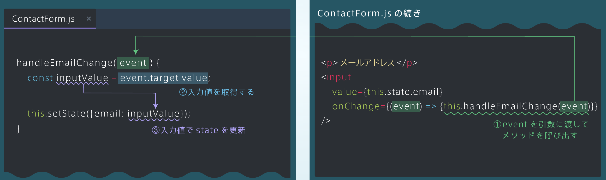

## 入力値のstate管理
### stateとinputの準備
・Reactでフォームを作る場合、stateと入力値を紐づける必要がある<br>
・メールアドレスの入力値を管理するstateのemailを用意する<br>
・また、inputタグのvalue属性にstateの値を指定する

```rb
    super(props);
    this.state = {
      isSubmitted: false,
      email: '',
    };
  }
  ```



### value属性の指定（補足）
・HTMLと同様にvalue属性に値を指定することで、指定した値を表示することができる<br>
・そのため、value属性にstateの値を指定すると、フォームの入力欄にstateの値が表示される



## onChangeと入力値の取得
### onChangeイベント
・フォームの入力や削除が行われたときに処理を実行するには、onChangeイベントを用いる<br>
・inputタグに対してonChangeイベントを指定



### 入力値の取得
・入力値の取得は、onChangeイベントの関数にeventという引数を追加し、event.target.valueとすると取得できる<br>
・本レッスンでは詳しく理解する必要がないので、eventとevent.target.valueはセットで覚えておく

```rb
[ContactForm.js]
<input
     value={this.state.email}
     onChange={(event) => {console.log(event.target.value)}}
/>
```


## stateの更新
### stateを更新するメソッド
・handleEmailChangeメソッドをつくりstateの変更を行う<br>
・下図のようにメソッドにeventを渡していることに注目。こうすることでメソッド内で入力値を取得できる

```rb
[ContactForm.js]
handleEmailChange(event) {
     const inputValue = event.target.value;
     this.setState({email: inputValue});
}
<p>メールアドレス</p>
<input
     value={this.state.email}
     onChange={(event) => {this.handleEmailChange(event)}}
/>
```


