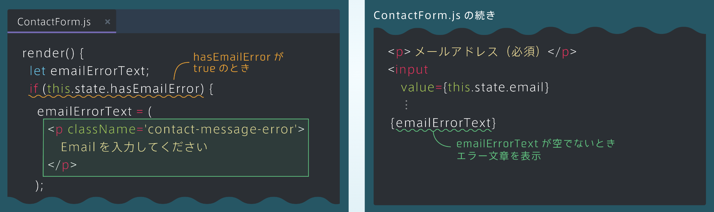
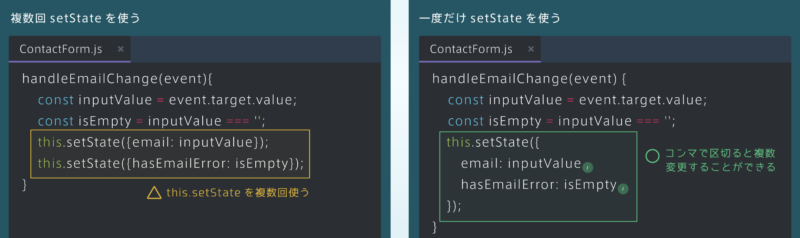
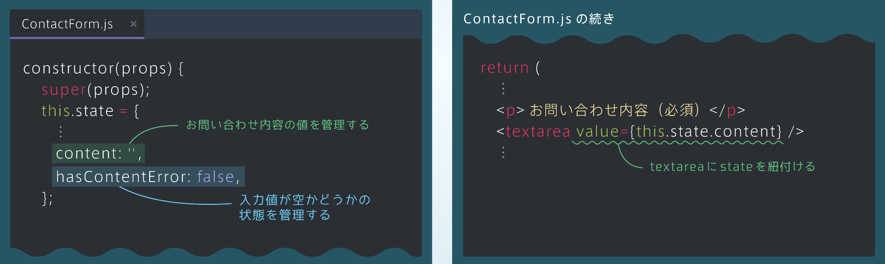
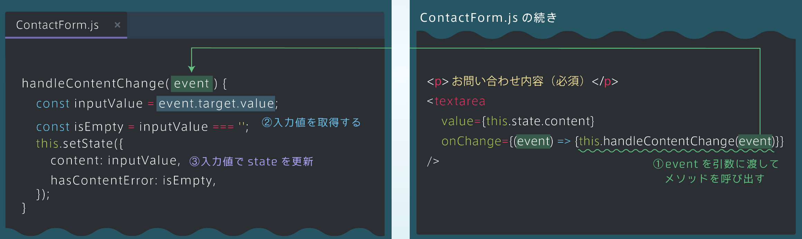
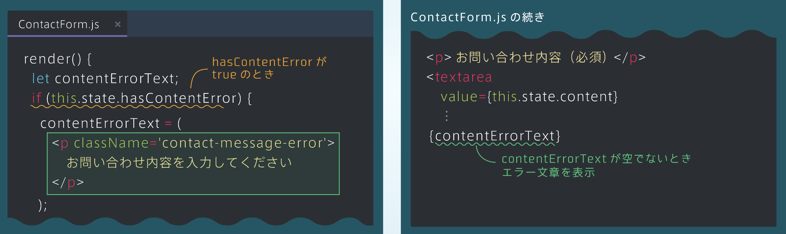

## エラーメッセージの作成
### 入力値が空かどうかを管理する
・入力値が空かどうかの状態をstateで管理する<br>
・stateに新たにhasEmailErrorという真偽値型のstateを定義する<br>
・右の図のように表示を切り替えられるようにしていく

```rb
[ContactForm.js]
constructor(props){
    super(props);
    this.state = {
        ⋮
        hasEmailError: false,
    };
}
```


### stateと条件分岐
・hasEmailErrorがtrueのとき、変数emailErrorTextにエラー部分のJSXを代入し表示するようにする

```rb
[ContactForm.js]
render(){
    let emailErrorText;
    if(this.state.hasEmailError){
        emailErrorText = (
            <p className='contact-message-error'>
              Emailを入力してください
            </p>
        );
            <p>メールアドレス（必須）</p>
            <input
              value={this.state.email}
              ⋮
            {emailErrorText}
```



## onChangeと入力チェック
### 入力値が空かどうかの判定
・メールアドレスの入力値が空かどうかを判定するために、handleEmailChangeメソッドに以下の処理を追加する

```rb
[ContactForm.js]
handleEmailChange(event){
    const inputValue = event.target.value;
    const isEmpty = inputValue ==='';
}               ↪︎入力値と空文字列('')を比較し結果をisEmpty代入する
⋮
<input
   value={this.state.email}
   onChange={(event) => {this.handleEmailChange(event)}}
   />
```

◽ 複数回setStateを使う
```rb
[ContactForm.js]
handleEmailChange(event){
    const inputValue = event.target.value;
    const isEmpty = inputValue ==='';
    this.setState({email:inputValue});
    this.setState({hasEmailError:isEmpty});
}               ↪︎this.setStateを複数回使う 
```

◽ 一度だけsetStateを使う
```rb
[ContactForm.js]
handleEmailChange(event){
    const inputValue = event.target.value;
    const isEmpty = inputValue ==='';
    this.setState({  ←コンマで区切ると複数変更することができる
        email:inputValue,
        hasEmailError:isEmpty,
    });       
}
```


## お問い合わせ内容のstate管理
### 入力値の管理と入力チェック
・お問い合わせ欄の入力値もstateで管理し、入力チェックも行うようにする<br>
・メールアドレス欄と同じように、入力値が空であればエラーを表示

### 2つのstateと入力値の表示
・お問い合わせ欄の入力値を管理するcontentと、入力値が空かどうかを管理する<br>
・hasContentErrorという2つのstateを用意する<br>
・textareaタグでもvalue属性にstateの値を指定することで入力値を表示できる

```rb
[ContactForm.js]
constructor(props){
    super(props);
    this.state = {
        ⋮
        contact:'',
        hasEmailError: false,
    };
return(
   ⋮
   <p>お問合せ内容（必須）</p>
   <textarea value={this.state.content} />
   ⋮
```



### onChangeとstateの更新
・textareaタグのonChangeイベントでメソッドを呼び出し、2つのstateを更新する<br>
・eventを引数に渡し、event.target.valueで入力値を取得する

```rb
[ContactForm.js]
handleEmailChange(event){
    const inputValue = event.target.value;
    const isEmpty = inputValue ===''; ②入力値を取得
    this.setState({ 
        content: inputValue,
        hasEmailError:isEmpty, ③入力値でstateを更新
    });       
}
<p>お問合せ内容（必須）</p>
   <textarea 
   value={this.state.content} 
   onChange={(event) => {this.handleContentChange(event)}}
   />
```


### エラーメッセージ
・hasContentErrorと条件分岐を用いてエラーメッセージを表示する

```rb
[ContactForm.js]
render(){
    let contentErrorText;
    if(this.state.hasContentlError){
        contentErrorText = (
            <p className='contact-message-error'>
              お問合せ内容を入力してください
            </p>
        );
            <p>メールアドレス（必須）</p>
            <textarea
              value={this.state.content}
              ⋮
            {contentErrorText}
```



<details><summary>コード</summary>

```rb
[ContactForm.js]
import React from 'react';

class ContactForm extends React.Component {
  constructor(props) {
    super(props);
    this.state = {
      isSubmitted: false,
      email: '',
      hasEmailError: false,
      /* contentとhasContentErrorというstateを追加してください */
      content: '',
      hasContentError: false,
    };
  }

  handleEmailChange(event) {
    const inputValue = event.target.value;
    const isEmpty = inputValue === '';
    this.setState({
      email: inputValue,
      hasEmailError: isEmpty,
    });
  }

  /* handleContentChangeという名前のメソッドを定義してください */
  handleContentChange(event) {
    const inputValue = event.target.value;
    const isEmpty = inputValue === '';
    this.setState({
      content: inputValue,
      hasContentError: isEmpty,
    });
  }

  handleSubmit() {
    this.setState({isSubmitted: true});
  }

  render() {
    let emailErrorText;
    if (this.state.hasEmailError) {
      emailErrorText = (
        <p className='contact-message-error'>
          メールアドレスを入力してください
        </p>
      );
    }
    
    /* 変数contentErrorTextを定義してください */
    let contentErrorText;
    
    /* hasContentErrorを条件にしたif文を作成してください */
    if (this.state.hasContentError) {
      contentErrorText = (
        <p className='contact-message-error'>
          お問い合わせ内容を入力してください
        </p>
      )
    }
    
    let contactForm;
    if (this.state.isSubmitted) {
      contactForm = (
        <div className='contact-submit-message'>
          送信完了
        </div>
      );
    } else {
      contactForm = (
        <form onSubmit={() => {this.handleSubmit()}} >
          <p>メールアドレス（必須）</p>
          <input
            value={this.state.email}
            onChange={(event) => {this.handleEmailChange(event)}}
          />
          {emailErrorText}
          <p>お問い合わせ内容（必須）</p>
          {/* stateのvalueの値と、onChangeイベントを追加してください */}
          <textarea
            value={this.state.content}
            onChange={(event) => {this.handleContentChange(event)}}
          />
          {/* contentErrorTextを表示してください */}
          {contentErrorText}
          
          <input
            type='submit'
            value='送信'
          />
        </form>
      );
    }
    
    return (
      <div className='contact-form'>
        {contactForm}
      </div>
    );
  }
}

export default ContactForm;
```
</details>